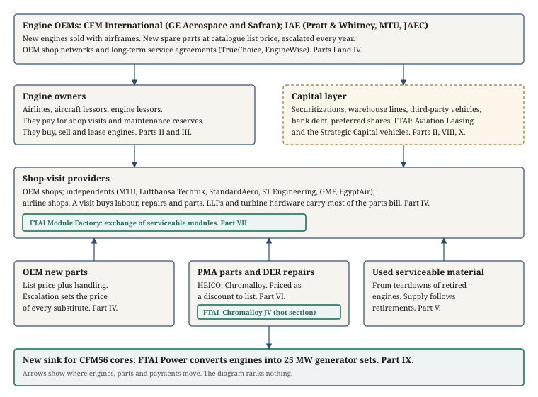

Part XII
<h1>Reference</h1>
This Part is the primer's back matter: a glossary of every term the registry assigns, the chain map with the Parts that carry each box, the margin pool in one table, an index of every company and institution named, the full register of what the research could not find, and the consolidated list of sources. A reader who has a term, a company or a figure in mind can start here and be sent to the section that treats it.

### How this Part is built

Part XII contains almost no new prose. Its six sections are compiled from files that already exist: the term registry (research/term-registry.md), the chain map drawn for the orchestrator, the margin exhibits of Part XI §86, the eleven Part files themselves, and section D of the reconciliation (research/reconciliation.md). Small scripts did the compiling, so that each entry can be traced to the file it came from and the compilation can be re-run when a Part changes. Where this Part states a figure, it is a figure another Part already states, with that Part named; where it states a definition, it is the definition the owner Part boxed. Nothing here is ranked and nothing is a view. Cross-references use the outline's section numbers, so "Part VII §46" means section 46 of the primer, which sits in Part VII.

## 90. Glossary

The glossary lists every term in section 1 of the term registry, {{N_GLOSSARY}} entries in all, in alphabetical order. The registry sorted terms under the Part that owns them; this section sorts them by name and gives the owner at the end of each entry. Each entry has the term, its acronym or alias where the registry records one, a definition of one or two sentences, and an owner line of the form "Owner: Part N §M", which names the section where the owner Part boxes the term. Where the owner Part did not box the term but another Part did (because that Part used it first), the owner line names both: "Owner: Part VIII; boxed in Part II §17". Where no Part boxed the term, the owner Part alone is given.

The definitions are pared, not rewritten. For the terms a Part boxed, the definition is the first one or two sentences of that Part's box, with citations and cross-reference sentences removed. For the dozen terms no Part boxed (company and timeline entries, aliases, and a few labels), the definition is the registry's own, tightened to two sentences. Figures that appear in a definition are the owner Part's figures and carry that Part's sources; the owner section should be read for the basis and date of any number quoted here. Twenty-four terms are defined differently by two or more dossiers; the registry's section 3 quotes both definitions and names the form the primer uses, and the owner Parts flag the difference where it matters (for example "core", which means the hot module in Part I and the returned unserviceable unit in Part VII §47). The Spine's own vocabulary is the registry's section 4, forty grouped entries, and every one of them appears below under its owner.

{{GLOSSARY}}

## 91. Chain map

The chain map is the one-page picture the orchestrator drew before the dossiers were commissioned, redrawn here from the research file research/chain-map.md. It shows where engines, parts and payments move between the links of the CFM56 aftermarket, and it fixed the segment list the eleven dossiers were written against. The paragraphs after the figure take each box in turn and say which Parts carry it. They say nothing about which boxes matter more; the diagram ranks nothing, and neither does this section.

<figure>
The CFM56 aftermarket chain as the orchestrator mapped it: engine OEMs at the top, engine owners and the capital layer beneath them, shop-visit providers in the middle, the three sources of material below, and FTAI Power as a new sink for cores at the bottom. Green boxes mark FTAI's positions. Arrows show where engines, parts and payments move. Source: research/chain-map.md, drawn 2026-10-03 and corrected for the Rome site (§94).
</figure>

**Engine OEMs.** The top box is the two manufacturers: CFM International, the joint venture of GE Aerospace and Safran that holds the type certificate for the CFM56 and the LEAP, and IAE, the consortium of Pratt & Whitney, MTU and the Japanese Aero Engines Corporation (JAEC) that holds it for the V2500. New engines are sold with airframes; new spare parts are sold at catalogue list price, revised upward each year; and the OEMs run shop networks and branded service agreements, TrueChoice and EngineWise. Part I §2 introduces CFM and the CFM56 family and Part I §10 the V2500 and the LEAP. Part III §20 carries the new engines' durability record. Part IV §25 carries the OEM shop network and Part IV §28 the OEM aftermarket model, including list prices, escalation and the service brands. Part VI §42 carries the OEM's responses to approved alternative parts, and Part XI §86.2 and §87 carry GE's Commercial Engines & Services segment and Safran's Propulsion figures from their filings.

**Engine owners.** The left-hand box in the second row is the airlines, aircraft lessors and engine lessors that own the engines. They pay for shop visits and maintenance reserves, and they buy, sell and lease engines. Part II §12 to §16 carries the contracts between them: the operating lease, maintenance reserves and return conditions, engine leasing and spare ratios, mid-life economics and green time. Part III §19 carries how an owner decides to retire an aircraft and Part III §22 what lessors and airlines did about extensions, availability and lease rates. Part VIII §58 and §59 carry FTAI's own position as an owner, including Russia, and Part XI §87 carries the three listed lessors' filings (Willis Lease, AerCap and Air Lease).

**Capital layer.** The right-hand box in the second row is the money behind the owners: securitizations, warehouse lines, third-party vehicles, bank debt and preferred shares. Part II §17 carries the instruments from first principles, with the WEST engine securitizations as the sourced template and a worked tranching example. Part VIII §60 to §66 carries FTAI's Strategic Capital Initiative, its two vehicles, their two layers of debt, the Servicer role, the money flows between FTAI and the vehicles and the comparable platforms. Part X §82 carries FTAI's own senior notes, revolver and preferred shares, and Part X §81 the inventory build that the balance sheet funds. The FTAI MRE 2026-1 securitization, priced in May 2026, is carried in Part II §17 and Part VIII §61 to §62.

**Shop-visit providers.** The wide box in the middle is where the engine is opened: the OEM's own shops, the independents (MTU, Lufthansa Technik, StandardAero, ST Engineering, GMF AeroAsia, EgyptAir and others) and the airlines' shops. A visit buys labour, repairs and parts, and life-limited parts and turbine hardware carry most of the parts bill. Part I §6 and §7 carry what a shop visit is and what it costs, with the cost build and a worked example. Part IV §25 to §30 carries the market: who performs visits, how many there are, what limits capacity, where the money in a visit goes and the four options for an engine at its life limit. Part XI §86.3 and §87 carry the independents' margins and statements from their filings.

**FTAI Module Factory.** The green tag inside the shop-visit box is FTAI's position in that link: the exchange of serviceable modules in place of a conventional visit. Part I §3 first boxes the module and the module exchange, and Part II §14 glosses FTAI's Maintenance, Repair and Exchange offer as a variant of shop-visit cover. Part VII §45 to §57 is the full treatment: what the segment sells, how an exchange works, pricing and revenue recognition, the MRE Contract revenue with the Strategic Capital vehicles, volumes and capacity, facilities and partners, the V2500 programme, the segment financials, the short report and the litigation, two worked examples and the guidance. Part X §79 to §81 carries the segment in the consolidated statements, and Part XI §86.7 sets its margin beside the other links on its stated basis.

**OEM new parts.** The left-hand box in the fourth row is the manufacturer's new parts at list price plus handling. Escalation of that list sets the price of every substitute, because used and approved alternative parts are priced as discounts to it. Part I §4 carries the life-limited-part prices by year and derives the escalation rate. Part IV §28 and §29 carry the catalogue, the escalation steps and the slice of a visit's bill they land on. Part III §24 turns escalation into a demand driver (row T-7), and Part XI §86.2 shows what the manufacturer reports earning on the parts and services line.

**PMA parts and DER repairs.** The middle box in the fourth row is the two legal routes to a part or a repair the manufacturer did not sell: a part made under a Parts Manufacturer Approval, by HEICO, Chromalloy and others, and a repair approved by a Designated Engineering Representative. Both are priced as a discount to list. Part I §5 boxes PMA briefly and Part I §9 boxes the DER repair. Part VI §37 to §44 is the full treatment: the four approval bases, critical parts and the hot section, EASA and the bilateral, DER repairs, the PMA market, acceptance by airlines and lessors and the OEM's responses, and a worked parts bill with and without PMA. Part XI §86.4 carries HEICO's Flight Support Group margin. The green tag inside the box, the FTAI–Chromalloy joint venture for hot-section parts, is carried in Part VI §43 (what is filed and what is reported), Part VII §52 (its place in the segment) and Part IV §29 (a first gloss).

**Used serviceable material.** The right-hand box in the fourth row is material recovered from torn-down engines, whose supply follows retirements. Part II §16 carries green time and the trade in part-worn engines. Part V §31 to §36 is the full treatment: what makes a used part serviceable, teardown and part-out economics with a worked 737-800 example, supply and the 2023 to 2026 shortage, pricing against new parts, the players and the module as a unit of trade. Part III §19 carries the retirements that did not happen and Part III §24 the feedstock-scarcity row (T-9). Part XI §86.5 carries AerSale's and AAR's filings, and Part VII §52 carries used material within FTAI's segment, including the exclusive serviceable-parts agreement with AAR.

**New sink for CFM56 cores.** The bottom box is FTAI Power, which converts CFM56 engines into 25 MW generator sets and so removes cores from the aviation pool permanently. Part IX §68 to §74 is the full treatment: the generator set and the aeroderivative from first principles, Mod-1 as FTAI describes it, J&F Power Systems and the $1.465B order, the data-center market and the turbine shortage, competing supply, permitting and interconnection, and two worked examples (implied unit price; cores consumed). Part III §18 glosses Mod-1 as a demand driver and Part III §24 carries it as row T-10. Part VII §49 notes that Mod-1 draws on the same module production as the aftermarket, and Part X §84 carries the 2027 guidance for the Power segment.

**The translation table and the Parts that answer it.** Part III §24 (Exhibit 3.14) turned each documented demand driver into a requirement on the aftermarket, in fourteen numbered rows. Parts IV to XI each open with a paragraph naming the rows they answer. Exhibit 12.1 was compiled by searching those opening paragraphs for the row identifiers; it says which Parts name each row, not which Part treats the underlying requirement, which Part III's Exhibit 3.15 gives.

Exhibit 12.1 — Translation-table rows T-1 to T-14 and the Parts that open by naming them

{{ROWTABLE}}

<cite>Source: the "Translation-table rows answered" paragraph at the head of each of Parts IV to XI, searched for the identifiers "row T-n" and "rows T-n, T-m"; row labels from Part III §24, Exhibit 3.14. Compiled for this Part on 2026-10-03.</cite>

## 92. Margin pool table

Part XI §86 built the margin pool link by link from the filings and ended with one table (Exhibit 11.4). This section consolidates every margin figure that section carries into one exhibit, with the company, the segment, the fiscal period, the margin, the basis and the source, and then lists FTAI's own margins as Parts VII and X state them. The caveats travel with the figures. The peers report profit on five bases (segment Adjusted EBITDA, segment operating income, adjusted EBIT, GE segment profit and gross margin), which Part XI §86 defines at its head; an EBITDA margin exceeds an EBIT margin for the same business by the depreciation share of revenue, so no two bases can be set beside each other without that share, which is mostly not disclosed. Three fiscal calendars are in use (December, October and May), euro figures are not converted, and "derived" marks a ratio computed in the research from two reported numbers. The rows below follow the order of the chain as Part XI walks it, from the manufacturer to the servicer; they are not ordered by margin, and the exhibit ranks nothing. The shares of a shop visit's bill in Part XI's Exhibit 11.1 (material 60 to 70%, labour 20 to 30%, repairs 10 to 20%) are shares of spending, not margins, and are not repeated here.

Exhibit 12.2 — Every margin figure in Part XI §86, by link in the chain, on its stated basis

| Company | Segment or scope | Fiscal period | Margin (and the figures behind it) | Basis | Source (Part XI section) |
|---|---|---|---|---|---|
| GE Aerospace | Commercial Engines & Services | CY2025 | 26.6% ($8,861M segment profit on $33,314M; services $25,010M, 75.1% of the segment, derived) | GE segment profit, GE's own measure; whether depreciation sits above or below it was not retrieved | GE 10-K FY2025 (§86.2) |
| GE Aerospace | Total company | CY2025 | No margin computed: operating profit $9.1B stated; total revenue not returned; items reconciling CES to the total not returned | Total-company operating profit | GE 10-K FY2025 (§86.2; D11 T4) |
| Safran | Propulsion | CY2025 | No margin reported in the retrieved text; services €10,122M were 64.6% of Propulsion revenue (about €15.7B, derived), against 61.7% in 2024 | Services share of revenue, not a margin | Safran FY2025 results, 13 Feb 2026 (§86.2) |
| StandardAero | Engine Services | CY2025 | 13.2% ($706.9M on $5,354.0M) | Segment Adjusted EBITDA, before depreciation, amortisation and defined adjustments | StandardAero 10-K FY2025 (§86.3) |
| StandardAero | Engine Services | CY2024 | 13.2% ($610.9M on $4,644.7M, derived) | Segment Adjusted EBITDA | StandardAero 10-K FY2025 (§86.3) |
| StandardAero | Component Repair Services | CY2025 | 28.6% ($202.7M on $708.6M) | Segment Adjusted EBITDA | StandardAero 10-K FY2025 (§86.3) |
| MTU Aero Engines | Commercial maintenance | CY2025 | 8.0% (€478M on €6.0B) | Adjusted EBIT, after depreciation and amortisation, before purchase-price-allocation effects | MTU, 24 Feb 2026 (§86.3) |
| MTU Aero Engines | Commercial maintenance | CY2024 | 8.7% (€438M on €5.1B) | Adjusted EBIT | MTU, 24 Feb 2026 (§86.3) |
| MTU Aero Engines | Group | CY2025 | 15.5% (€1.35B on €8.7B adjusted revenue); 14.0% in 2024 | Adjusted EBIT, group | MTU, 24 Feb 2026 (§86.3) |
| Lufthansa Technik | Whole company | CY2025 | 7.5% (€603M on €8.049B); 8.5% in 2024 | Adjusted EBIT, company; engine services "almost half" of revenue | Lufthansa Technik FY2025 results; Deutsche Lufthansa Annual Report 2025 (§86.3) |
| HEICO | Flight Support Group | FY to 31 Oct 2025 | 24.1% ($750.4M on $3,117.3M, derived); 22.5% in FY2024 | Segment operating income, after depreciation and amortisation; the segment includes repair and distribution as well as PMA | HEICO 10-K FY2025; HEICO release, 18 Dec 2025 (§86.4) |
| AerSale | Asset Management Solutions | CY2025 | 35.0% ($74.1M on $211.6M, derived); 38.3% in 2024 ($82.5M on $215.5M) | Gross margin, before all operating expenses | AerSale 10-K FY2025; release 5 Mar 2026 (§86.5) |
| AerSale | AMS, aircraft line | CY2025 | 33.2%; 34.8% in 2024 | Gross margin | AerSale 10-K FY2025 (§86.5) |
| AerSale | Whole company | CY2025 | 13.8% ($46.1M on $335.3M); 9.7% in 2024 ($33.4M) | AerSale-defined Adjusted EBITDA | AerSale release, 5 Mar 2026, via D3 (§86.5) |
| Safe Fly Aviation (consultancy blog) | A run-out CFM56 teardown | 2026 | Not a percentage: an engine bought for $0.8–1.2M yields $1.6–2.2M of used material, a net margin of $0.4–0.8M per engine | Dollars per engine from a consultancy blog, labelled so | Safe Fly Aviation, 2026 (§86.5) |
| AAR | Parts Supply | FY to 31 May 2026 | Not returned; the segment is about 45% of $3,308.0M of sales (both derived) | n/a | AAR 10-K FY2026 (§86.5) |
| Willis Lease Finance | Whole company | CY2025 | 62.9% ($459.1M on $730.2M, derived) | Company-defined Adjusted EBITDA; depreciation and interest, a lessor's largest costs, sit below the line | WLFC 10-K FY2025 (§86.6) |
| AerCap | Whole company | CY2025 | No margin basis returned; maintenance rents $690M were 9.4% of lease revenue of $7,369M (derived); net income $3.8B against $2.1B, drivers not returned | n/a | AerCap 20-F FY2025; Q4 2025 release (§86.6) |
| Air Lease | Whole company | CY2025 | No margin returned; lease rental revenue $2,615.4M on net book value of $29.1B is a 9.0% gross yield (derived) | Yield on book, not a margin | Air Lease 10-K FY2025 (§86.6) |
| FTAI | Aerospace Products | CY2025 | 34.7% ($671,252K on $1,936,244K, derived; revenue includes MRE Contract revenue of $335,788K from the 2025 Partnership) | FTAI-defined segment Adjusted EBITDA | FTAI 10-K FY2025 (§86.7); Exhibit 12.3 |
| FTAI | Aerospace Products | Q2 2026 | 28.5% ($249.7M on $875.0M, derived; MRE $182.8M) | FTAI-defined segment Adjusted EBITDA | FTAI Q2 2026 release; 10-Q (§86.7); Exhibit 12.3 |
| FTAI | Aviation Leasing | CY2025 | No margin computable on the retrieved lines: segment Adjusted EBITDA $608.9M against lease income $235.2M is 259%, because the measure includes gains on sale and equity income and the segment's full revenue mapping was not retrieved | FTAI-defined segment Adjusted EBITDA | FTAI 10-K FY2025 (§86.6) |
| FTAI | Consolidated | CY2025 | 47.5% ($1,190,922K on $2,507,409K, arithmetic in Part XI); depreciation and amortisation $225,797K (9.0% of revenue) and interest $247,751K sit below | Company-defined Adjusted EBITDA | FTAI 10-K FY2025 (§86.7, Exhibit 11.3) |
| FTAI | Servicer to the 2025 Partnership | FY2025; 1H 2026 | No margin disclosed; servicing fees $10.2M and $12.85M; rate and base undisclosed | Fee income | FTAI 10-K FY2025; 10-Q Q2 2026 (§86.8; Part VIII §63) |

<cite>Source: Part XI §86.2 to §86.8 and Exhibits 11.2, 11.3 and 11.4, which cite GE Aerospace Form 10-K FY2025; Safran FY2025 results presentation, 13 Feb 2026; StandardAero, Inc. Form 10-K FY2025; MTU Aero Engines, 24 Feb 2026; Lufthansa Technik FY2025 results and Deutsche Lufthansa AG Annual Report 2025; HEICO Corporation Form 10-K FY2025 and release of 18 Dec 2025; AerSale Corporation Form 10-K FY2025 and release of 5 Mar 2026; AAR Corp Form 10-K FY2026; Willis Lease Finance Corporation Form 10-K FY2025; AerCap Holdings N.V. Form 20-F FY2025; Air Lease Corporation Form 10-K FY2025; FTAI Aviation Ltd. Form 10-K FY2025 and Form 10-Q Q2 2026; Safe Fly Aviation, 2026 (consultancy blog). The five bases are defined at the head of Part XI §86 and are not interchangeable. Reconciliation E.1 rule 35; R-021, R-023, R-043, R-045; D11 T3, T4.</cite>

Exhibit 12.3 collects FTAI's own margins, which Part VII §53 (Exhibits 7.11 to 7.13) and Part X §79 and §80 (Exhibits 10.8 to 10.13) state. The main series is Aerospace Products segment Adjusted EBITDA divided by segment revenue, where segment revenue is the "Aerospace products revenue" line plus, from 2025, the "MRE Contract revenue" line, a sum the FY2025 10-K's geographic table confirms for 2025. Three caveats travel with the series. MRE Contract revenue is related-party revenue from vehicles in which FTAI holds a 19% stake (20% in the Q3 2025 10-Q), and the profit on it is eliminated through equity-method earnings by a method the filing does not disclose (Part VII §48; Part VIII §63). The segment's cost of sales for FY2025 appears as $1,240,368K in the segment expenses table and the consolidated cost-of-sales line as $1,349,719K, and the gross margins below carry each figure's scope (Part VII §53; reconciliation R-045). And the quarterly figures for Q2 2025 and Q4 2025 are derived from growth rates or a stated margin rather than read from a filing, as their rows say. Consolidated Adjusted EBITDA is the company's own measure, whose exact FY2025 definition and reconciliation the research did not retrieve (Part X §80).

Exhibit 12.3 — FTAI's own margins as Parts VII and X state them: segment Adjusted EBITDA on segment revenue by year and quarter, gross margins by scope, and the consolidated figures

| Measure | Period | Revenue base ($ thousands unless stated) | Profit measure | Margin | Basis and caveat | Stated in |
|---|---|---|---|---|---|---|
| Aerospace Products segment Adjusted EBITDA ÷ segment revenue | FY2022 | 85,113 (products line; no MRE line) | 27,377 | 32.2% (derived) | Segment figures from the FY2022 10-K; the segment was ramping | Part VII Exhibit 7.11 |
| Same | FY2023 | 454,970 | 160,009 | 35.2% (derived) | FY2025 10-K segment table | Part VII Exhibit 7.11; Part X Exhibit 10.11 |
| Same | FY2024 | 1,079,821 | 380,636 | 35.2% (derived) | FY2025 10-K segment table | Part VII Exhibit 7.11; Part X Exhibit 10.11 |
| Same | FY2025 | 1,936,244 = products 1,600,456 + MRE Contract 335,788 | 671,252 | 34.7% (derived; the release gives +76% growth in segment Adjusted EBITDA) | MRE Contract revenue is related-party revenue (R-043); FTAI-defined measure | Part VII Exhibits 7.11 and 7.12; Part X Exhibit 10.11; Part XI Exhibit 11.3 |
| Same | Q2 2025 | ≈491,600 (derived: 875.0 ÷ 1.78) | ≈165,400 (derived: 249.7 ÷ 1.51) | ≈33.6% (derived) | Both figures back-derived from the Q2 2026 release's year-on-year growth rates | Part VII Exhibit 7.12; Part X Exhibit 10.12 |
| Same | Q4 2025 | ≈557,000 (derived: 195 ÷ 0.35) | 195,000 (stated, rounded) | 35% (stated by management) | Margin from call coverage (MarketBeat, 26 Feb 2026); EBITDA from the release | Part VII Exhibit 7.12; Part X Exhibits 10.12 and 10.13 |
| Same | Q1 2026 | 743,800 = 522,585 products + 221,230 MRE | 222,600 | 29.9% (derived) | MRE was 29.7% of segment revenue (derived) | Part VII Exhibit 7.12; Part X Exhibit 10.12 |
| Same | Q2 2026 | 875,000 = ≈692,200 products (derived) + 182,800 MRE | 249,700 | 28.5% (derived) | MRE to the 2025 Partnership $182.8M (10-Q); eliminations $6.6M in the quarter | Part VII Exhibit 7.12; Part X Exhibit 10.12; Part XI Exhibit 11.3 |
| Same | 1H 2026 | ≈1,618,800 (derived: 1,214,800 products + 404,000 MRE) | ≈472,300 (derived: 222,600 + 249,700) | ≈29.2% (derived) | Sum of two quarters; no half-year segment figure was retrieved | Part VII Exhibit 7.12; Part X Exhibit 10.9 |
| Management's stated aspiration for the segment margin | 2026 | n/a | n/a | "approach 40%" | Call coverage (MarketBeat, 26 Feb 2026); an aspiration, not a result; levers named were the PMA HPT blade, more used material and the CFM materials agreement | Part VII §53 and §57; Part XI §86.9 |
| Aerospace Products gross margin (segment scope) | FY2025 | 1,936,244 | Segment cost of sales 1,240,368 | 35.9% (derived) | Scope per the orchestrator's reading of the segment expenses table (R-045) | Part VII Exhibit 7.13 |
| Gross margin, scope unconfirmed | 1H 2026 | ≈1,618,800 | Cost of sales 1,160,100 returned against the same segment query | 28.3% (derived) | Segment or consolidated scope not confirmed | Part VII Exhibit 7.13; Part X Exhibit 10.9 |
| Consolidated revenue less cost of sales ÷ revenue | FY2023 | 1,170,896 | Cost of sales 502,132 | 57.1% (derived; cost of sales 42.9% of revenue) | Consolidated cost of sales includes the carrying value of leased assets sold | Part VII Exhibit 7.13; Part X Exhibit 10.8 |
| Same | FY2024 | 1,734,901 | Cost of sales 825,884 | 52.4% (derived; 47.6%) | As above | Part VII Exhibit 7.13; Part X Exhibit 10.8 |
| Same | FY2025 | 2,507,409 | Cost of sales 1,349,719 | 46.2% (derived; 53.8%) | As above; the difference from the segment figure, 109,351, is close to asset sales revenue of 106,945, presented gross | Part VII Exhibit 7.13; Part X Exhibit 10.8 |
| Consolidated Adjusted EBITDA ÷ total revenues | FY2023 | 1,170,896 | 597,282 | 51.0% (arithmetic in this Part on Part X's figures) | Company-defined measure; definition and reconciliation not fully retrieved (D10 U-1) | Part X Exhibits 10.8 and 10.11 (figures) |
| Same | FY2024 | 1,734,901 | 862,050 | 49.7% (arithmetic in this Part on Part X's figures) | As above | Part X Exhibits 10.8 and 10.11 (figures) |
| Same | FY2025 | 2,507,409 | 1,190,922 | 47.5% (arithmetic in Part XI) | As above; D&A 225,797 and interest 247,751 sit below the measure | Part XI Exhibit 11.3; Part X Exhibit 10.8 |
| Aviation Leasing segment Adjusted EBITDA against lease income | FY2024 | Lease income 234,411 or 255,338 (two readings of the 10-K, R-052) | 500,062 | Not a margin | The measure includes gains on sale and equity income; the segment's other revenue lines for 2024 were not retrieved | Part X Exhibit 10.11; Part XI Exhibit 11.3 |
| Same | FY2025 | Lease income 235,210 (maintenance revenue 218,499 and asset sales revenue 106,945 sit on the consolidated statement; their segment mapping was not retrieved) | 608,912 | Not a margin (259% of lease income; 109% of the three lines summed) | Includes the $46.4M gain on sale to the 2025 Partnership and the equity-method pick-up | Part XI §86.6 and Exhibit 11.3; Part VIII §58 |
| Aviation Leasing segment Adjusted EBITDA | Q2 2026 | not retrieved | 88,200 (call coverage only; not returned from the release, R-051) | Not computable | Call coverage (GuruFocus, Quartr) | Part X Exhibits 10.12 and 10.13 |
| Segment share of consolidated Adjusted EBITDA (Aerospace Products) | FY2023; FY2024; FY2025 | Consolidated Adjusted EBITDA | Segment Adjusted EBITDA | 26.8%; 44.2%; 56.4% (derived) | A share of profit, not a margin; shown because Part VII states it | Part VII Exhibit 7.11 |

<cite>Source: Part VII §53, Exhibits 7.11, 7.12 and 7.13; Part X §79 and §80, Exhibits 10.8, 10.9, 10.11, 10.12 and 10.13; Part XI §86.6, §86.7 and Exhibit 11.3. Underlying filings: FTAI Aviation Ltd. Form 10-K FY2025 (segment table, segment expenses table, consolidated statement of operations), Form 10-K FY2022, Forms 10-Q for Q1 and Q2 2026, Q4/FY2025 release of 25 Feb 2026, Q1 2026 release, Q2 2026 release of 29 Jul 2026; MarketBeat call coverage, 26 Feb 2026; GuruFocus and Quartr call coverage, 30 Jul 2026. Reconciliation R-043, R-045, R-047, R-051, R-052, B-1; E.1 rules 8, 10, 12, 28.</cite>

## 93. Company index

The index lists every company, joint venture, investment vehicle and institution named in the eleven Parts: FTAI's own entities and vehicles, the engine and airframe manufacturers, the shops, the parts makers and traders, the lessors and the capital providers, the airlines, the appraisers and data providers, the consultancies and market-research vendors, the regulators and courts, the law firms, auditors and rating agencies, and the trade publications and news services the Parts cite. The index has {{N_COMPANIES}} entries. It was built with a script that searched a curated list of names, each as a pattern allowing for the variants the Parts use, across the eleven Part files, and recorded the numbered section in which each match fell. The entries are alphabetical. Each gives the ticker where the company is listed (tickers are identifiers added for the reader's convenience and are not drawn from the research files), one line on the role the company plays in the primer, and the Parts and sections in which it appears. Where a company appears in more than seven sections of one Part, the entry gives the range and the count. "Unknowns list only" means the name appears in that Part only in its closing list of unknowns. The role lines are descriptive and carry no view of any company.

Exhibit 12.4 — Company index: every company, vehicle and institution named in Parts I to XI, with role and location

{{COMPANIES}}

<cite>Source: the eleven Part files in parts/, searched on 2026-10-03 for a curated list of names and their variants; section numbers are those of the outline. Roles are summarised from the Parts named in each row. Tickers are listing identifiers and are not research findings; Air Lease's ticker is given as former because the company was taken private on 8 Apr 2026 (Part XI §87).</cite>

## 94. Unknowns register

The reconciliation's section D is the consolidated register of what the eleven dossiers could not find: {{N_UNKNOWNS}} entries, each copied verbatim from its dossier with an id of the form U-D5-07 (dossier D5, its seventh unknown). The reconciliation grouped the entries that ask the same question into {{N_CLUSTERS}} clusters covering {{N_CLUSTERED}} entries and left the other {{N_SINGLE}} as singletons. This section reproduces the register in that order: the clusters first (§94.1), then the singletons grouped by the Part that owns them (§94.2), then a table of every entry the orchestrator notes or the Parts resolved in whole or in part during the build, with the resolving fact and its source (§94.3). Every question is given in the words its dossier used, including the dossier's own numbering (U1, U-1) and its internal source references in square brackets, which point to that dossier's source list. Each entry also says which Parts carry it in their closing unknowns lists. An entry that §94.3 lists as resolved is left unchanged in §94.1 or §94.2, so that the register remains the record of what was asked; the resolution sits only in the table. The register is long, and that is its purpose: the primer never fills an absence, so the absences must be listed.

{{UNKNOWNS}}

### 94.3 Resolved during the build

The orchestrator ran a small number of its own searches after the dossiers were written, recorded in research/orchestrator-notes.md, and the Parts' authors found a few further facts while writing. Exhibit 12.5 lists every register entry those efforts resolved, in whole or in part, with the resolving fact and its source. "Part" in the extent column means the entry still has open components, which the row names. The entries themselves stand unaltered above; a reader checking a question should read the entry there and the resolution here.

Exhibit 12.5 — Register entries resolved in whole or in part during the build, with the resolving fact and source

| Entry (cluster) | The question, in brief | Resolving fact | Source | Extent |
|---|---|---|---|---|
| U-D5-07, U-D10-11 (K-12) | Deal terms for FTAI's maintenance facilities | LMCES, Montréal: acquired 9 Sep 2024 from Lockheed Martin Canada, total consideration $170.0M, 526,000 sq ft; at closing Montréal plus Miami gave capacity for 1,350 CFM56 module overhauls and more than 500 engine tests a year. QuickTurn, Miami: iAero Thrust assets acquired 4 Jan 2023 with Unical Aviation; Unical's remaining interest bought 1 Dec 2023 for $30.3M cash. QuickTurn Europe, Rome Fiumicino: $10.5M for 50%, closed 5 Jun 2025, 200,000 sq ft, adding capacity for 450 modules (150 engines) a year | GlobeNewswire, 9 Sep 2024; Aviation Week, "FTAI Aviation Snaps Up LMCES For $170 Million"; GlobeNewswire, 1 Dec 2023; GlobeNewswire, 26 Feb 2025 and 5 Jun 2025; FTAI 10-K FY2025 | Part: Orange (nature, size, date) and Lisbon (size, capacity, opening) remain open, as do the Chromalloy JV's deal terms and the infrastructure businesses' figures |
| U-D5-09, U-D10-17 (K-13) | Headcount, test cells, properties | 985 full-time employees and independent contractors at 31 Dec 2025; 494 full-time employees in Canada, about 71% of them under collective bargaining agreements. Engine-test capacity "more than 500" a year (Sep 2024) and "more than 600" (Feb 2025) | FTAI 10-K FY2025; GlobeNewswire, 9 Sep 2024 and 26 Feb 2025 | Part: employees by site, test-cell count and the properties list remain open |
| U-D10-17, U-D5-07 | The Rome site's location ("Rome NY" in the dossier's properties list and the chain map) | FTAI's Rome site is QuickTurn Europe at Rome Fiumicino Airport, Italy, the former IAG Engine Center. "Rome NY" was an orchestrator error in the chain map, copied by two dossiers, and was corrected in the research files; no Part repeats it as fact | FTAI 10-K FY2025; GlobeNewswire, 5 Jun 2025; reconciliation R-040; orchestrator notes | Whole, for the location |
| U-D5-16, U-D10-16 (K-11) | Status of the securities class action; auditor; internal control | Class action: S.D.N.Y. No. 25-cv-00541, Judge Jeannette A. Vargas; class period 23 Jul 2024 to 21 Jan 2025; defendants' motion to dismiss the amended complaint filed 20 Nov 2025, fully briefed and pending. Auditor: Ernst & Young LLP 2016 to 2025; the Audit Committee engaged KPMG LLP for FY2025 effective 17 Jun 2025; the auditor's report is dated 27 Feb 2026. The Audit Committee's internal investigation concluded the short report's allegations were "all without merit" | Law-firm case pages (ktmc.com, rgrdlaw.com; last-update date not visible); FTAI 10-K FY2025 | Part: the internal-control conclusion, any derivative suits and the 10-K's own description of the case remain open (R-066 records an ambiguity in the auditor line) |
| U-D5-19, U-D6-02, U-D10-01 (K-17) | Segment revenue and Adjusted EBITDA by year; the full income statement | FY2025 10-K segment table ($ thousands, 2023 / 2024 / 2025): total revenues 1,170,896 / 1,734,901 / 2,507,409; total Adjusted EBITDA 597,282 / 862,050 / 1,190,922; Aerospace products revenue 454,970 / 1,079,821 / 1,600,456; MRE Contract revenue 0 / 0 / 335,788; Aerospace Products Adjusted EBITDA 160,009 / 380,636 / 671,252; lease income not returned / 234,411 (or 255,338, two readings) / 235,210; Aviation Leasing Adjusted EBITDA not returned / 500,062 / 608,912. FY2025 consolidated lines: cost of sales 1,349,719; operating expenses 152,541; G&A 9,478; D&A 225,797; interest expense 247,751. FY2022 10-K: segment revenues 2022 / 2021 Aviation Leasing 199,040 / 128,328, Aerospace Products 85,113 / 70,800 (2021 figure flagged as a probable extraction artefact), Corporate and Other 26,948 / 14,161; 2022 segment Adjusted EBITDA 107,556 / 27,377 / (7,277); net income attributable 2022 (220,374), 2021 (128,992), not comparable with 2023 onward because of discontinued operations | FTAI 10-K FY2025; FTAI 10-K FY2022 | Part: 2023 Leasing lines, 2023 to 2024 maintenance and asset-sales lines, the Adjusted EBITDA reconciliation, net income attributable by year, 1H totals and the 2021 segment figures remain open |
| U-D10-01, D5 T5 (R-045) | Which cost-of-sales figure is which | Both FY2025 figures are in the 10-K: $1,240,368K is the Aerospace Products segment's cost of sales in the segment expenses table; $1,349,719K is the consolidated cost-of-sales line. The segment gross margin of 35.9% on segment revenue is a derived figure | FTAI 10-K FY2025; orchestrator notes | Whole, for the scopes; the 10-K's mapping of the $109,351K difference was not retrieved |
| U-D7-06 | MRE revenue from the vehicles | MRE Contract revenue with the 2025 Partnership: Q2 2026 $182.8M (Q2 2025 $69.6M); 1H 2026 $404.0M (1H 2025 $170.2M). The 10-Q defines the line as "the transaction price for sales of CFM56-5B, CFM56-7B and V2500 engines and related modules to the SPVs of the first SCI partnership" | FTAI 10-Q Q2 2026 | Part: counts of engine and module exchanges remain open |
| U-D5-17 | Named customers, concentration, related-party disclosure | The related-party revenue is identified and quantified as above. Two Aerospace Products customers accounted for 16% and 11% of revenue in Q3 2025 | FTAI 10-Q Q2 2026; FTAI 10-Q Q3 2025 | Part: customer names and annual concentration remain open |
| U-D6-11, U-D10-13 (K-07) | Equity-method stakes, percentages and carrying values | At 31 Dec 2025: Advanced Engine Repair JV 25%, $22,429K ($15.0M invested Dec 2016, $13.5M Aug 2019); 2025 Partnership 19% (20% in the Q3 2025 10-Q), $281,740K, $151.6M invested in 9M 2025, FTAI as Servicer; QuickTurn Europe 50%, $9,987K; Prime Engine Accessories 50%, carrying value not returned. Exhibit 21.1 (subsidiaries) located | FTAI 10-K FY2025; FTAI 10-Q Q3 2025, note R13 | Part: which investment the Aviation Leasing segment leases "through", and FTAI Finance Holdco's role, remain open |
| U-D4-03, U-D5-11 (K-04) | FTAI–Chromalloy joint venture terms and contribution | The Advanced Engine Repair JV figures above apply only if that venture is the Chromalloy PMA joint venture; the 10-K describes the PMA venture only as "a joint venture", and the identity is unknown | FTAI 10-K FY2025; orchestrator notes | Part, conditionally: terms, accounting and contribution remain open |
| U-D3-07 | FTAI's exclusive partner for teardown, repair, marketing and sale of CFM56 parts | AAR Corp, under a Serviceable Engine Products agreement that the two companies extended through 2030, covering teardown, repair, marketing and sale of material from FTAI's pool of over 450 CFM56 engines | AAR release, 27 Mar 2025 (PR Newswire; body as carried by ePlaneAI); reconciliation B-9 | Part: the agreement's economic terms remain open |
| U-D3-14 | Unical Aviation | Unical Aviation was FTAI's joint-venture partner in QuickTurn Miami until 1 Dec 2023 | GlobeNewswire, 1 Dec 2023; FTAI 10-K FY2025 | Part: Unical's own scale remains open |
| U-D5-13 | Muddy Waters' own wording | The complaint's allegations as summarised on law-firm pages: one-time engine sales reported as MRO revenue; whole-engine sales presented as module sales; depreciation of engines not on lease lowering reported cost of goods sold | Law-firm case pages (ktmc.com, rgrdlaw.com) | Part: the report's own wording remains open |
| U-D8-02 | J&F ownership, control and consolidation | Description added: the Q2 2026 10-Q calls J&F "a strategic packaging and distribution joint venture with Jereh Group, a global leader in gas turbine mobile packaging, to support the planned 2027 production target of 100 Mod-1 CFM56 aeroderivative units" | FTAI 10-Q Q2 2026 | Description only; ownership split and consolidation remain open |
| U-D10-14, U-D7-09 | Guidance in full, including the 2026 path and any Leasing-specific item | 2027 Business Segment Adjusted EBITDA guidance $2.3B: Aerospace Products $1.4B, FTAI Power $450M, Aviation Leasing $450M. The 2026 path: $1.4B (Dec 2024 and early 2025); $1.525B = $1.0B Aerospace Products + $525M Leasing (27 Oct 2025); $1.625B = $1.05B + $575M (25 Feb 2026); $1.525B = $1.05B + $475M (29 Jul 2026), the Leasing cut "reflecting its continued shift to an asset-light business model". The 2026 module target of 1,050 (25 Feb 2026 release) was raised to 1,200 on the 30 Jul 2026 call, a figure that comes from call coverage and was not confirmed in the release text | FTAI Q2 2026 release, 29 Jul 2026 (text as carried by Barchart); Q3 2025 release, 27 Oct 2025; Q4/FY2025 release, 25 Feb 2026; GuruFocus, Nasdaq.com, MarketBeat call coverage, 30 Jul 2026; reconciliation R-036, R-049 | Part: the 2025 guidance as set on 30 Dec 2024 is supplied by dossier D7; whether the 29 Jul 2026 release itself carries 1,200 modules is unverified |
| U-D10-08 | Dividend and share-count history | Ordinary dividend per share: $0.30 for Q1 and Q2 2025; $0.35 for Q3 2025 (declared 27 Oct 2025, payable 19 Nov 2025); $0.40 for Q4 2025 (declared 25 Feb 2026); $0.45 for Q1 2026 (declared Apr 2026); $0.50 for Q2 2026 (declared 29 Jul 2026) | GlobeNewswire release titles and texts; reconciliation R-068 | Part: 2022 to 2024 dividends, weighted share counts by year and the repurchase program's terms remain open |
| U-D10-09 | Officers' titles and tenure (CFO confirmation) | Nicholas McAleese was appointed Chief Financial Officer and Michael Hazan Chief Accounting Officer on 6 Mar 2026, succeeding Eun (Angela) Nam, who left for a role outside aviation; the 2025 proxy named Nam because it predates the change | FTAI release, 6 Mar 2026 (carried by StreetInsider, Barchart, Finviz); reconciliation R-067 | Part: the General Counsel's name, David Moreno's current role and start dates remain open |
| U-D6-03 | Q1 and Q2 2026 Leasing segment Adjusted EBITDA | $88.2M for Q2 2026, from call-coverage summaries only; the figure was not returned from the release text | GuruFocus; Quartr; reconciliation R-051 | Part, and only as call coverage; Q1 2026 remains open |
| U-D7-12 | The May 2026 ABS: whose deal, and its terms | FTAI MRE 2026-1, priced 22 May 2026, is the 2025 Partnership's inaugural asset-backed securitization: $612M of notes backed by 48 A320ceo and 737NG aircraft on lease to 23 airlines; Series A expected Asf (Fitch) and A(sf) (KBRA), Series B expected BBB+sf (Fitch); expected close 4 Jun 2026; both classes "significantly oversubscribed"; the vehicle "currently owns 292 aircraft" | FTAI release, 22 May 2026 (investor-relations node; carried by Finviz and by AviTrader, 26 May 2026) | Part: coupons and loan-to-value remain open |
| Gap-fill queue | Nine entries the orchestrator queued for its own searches: U-D5-04, U-D5-02, U-D1-09, U-D7-01, U-D7-02, U-D10-15, U-D5-14, U-D5-15 and U-D11-16 | No result recorded; the queue was not completed because the shared search budget was exhausted | Orchestrator notes, "Search budget" and "Gap-fill queue" | Not resolved; listed so the reader knows they were attempted |

<cite>Source: reconciliation.md section D.3; orchestrator-notes.md, "Gap-fill results", "Resolutions after reconciliation" and "Late addition" (all 2026-10-03); Part V §35 and Part VII §52 (AAR agreement); Part VIII §61 to §62 (FTAI MRE 2026-1); Part VII §50 and Part X §85 (Rome Fiumicino); Part X §78 (CFO). Each resolving fact is cited to the underlying filing, release or page named in the source column; the entries themselves are unchanged in §94.1 and §94.2.</cite>

## 95. Consolidated sources

Each Part ends with a numbered list of the sources it used. This section merges the eleven lists into one. The merge was done by a script: it read every numbered entry in each Part's "Sources" section, keyed entries by their URL (or by title where an entry has no URL, after normalising case and punctuation), kept one entry per key with the shortest of the descriptions the Parts gave it, sorted the result by publisher and then by date, numbered it, and recorded which Parts cite each entry. The eleven lists held {{N_CITATIONS}} citations of external sources; after the merge there are {{N_SOURCES}} distinct sources. Entries that point to the primer's own research files rather than to an external document are listed separately in §95.2, so that the numbered list contains only external sources. The numbering here is this section's own and does not match the numbers inside the Parts, which each Part's inline citations use. Where an entry gives two URLs, the Part cited both forms of the same document (for example an SEC exhibit and the GlobeNewswire release). Publisher names were normalised only where the same publisher appeared under two spellings; the descriptions are otherwise as the Parts wrote them, including notes such as "located, not read" and "date not visible".

### 95.1 The list

{{SOURCES}}

### 95.2 Research files cited by the Parts

The Parts cite the primer's own research files only for derived figures and definitions the research assembled, as the writer brief required. Those citations are listed here so the merge above is complete; the files themselves are published alongside the primer under research/.

{{INTERNAL}}

### 95.3 Sources and basis

The research for this primer is as of 3 October 2026. Every figure carries its source and date where the Parts state them, and every disagreement between sources is presented with both figures; nothing is averaged and nothing is chosen. The sources fall into a small number of kinds, and the Parts label each. Filings with the US Securities and Exchange Commission (Forms 10-K, 10-Q, 8-K, 20-F, 6-K, DEF 14A and their exhibits) were reached through search restricted to sec.gov, because direct access to EDGAR was blocked in the build environment; each filing figure is cited to the EDGAR URL the search returned, and where a search returned two readings of one line (for example FTAI's 2024 lease income) both are carried. Company releases were reached on GlobeNewswire, PR Newswire or the company's investor-relations pages. Earnings-call content was reached through third-party coverage (GuruFocus, MarketBeat, Quartr, Nasdaq.com, Barchart and transcript services) where the Parts say "call coverage", and the figures that rest on it alone, such as the 1,200-module 2026 target and the $88.2M Q2 2026 Leasing Adjusted EBITDA, are labelled so wherever they appear. Trade press (Aviation Week, Leeham News, Aircraft Commerce, Cargo Facts, AviTrader and others), regulators' documents (FAA, EASA, the eCFR) and appraisers' publications (IBA, mba Aviation, Cirium) are cited by name and date. Consultancy blogs, above all Safe Fly Aviation, are labelled "consultancy blog" at every use, and market-research vendors' market sizes are labelled as vendor figures whose scope definitions were not retrieved. A few entries are marked "located, not read" or "title located; body not read": the document's existence and title were established but its text was not retrieved, and the Parts use only the title. The eleven dossiers (D1 to D11), the reconciliation and the term registry from which the Parts were written are published alongside under research/, with the orchestrator notes and the chain map.

## Build notes

The primer was built from eleven research dossiers (D1 to D11 in research/dossiers/), one per segment of the chain map, each written by a separate research agent against a common brief; from a reconciliation pass (research/reconciliation.md) that cross-checked the dossiers and produced the tensions, corroborations, information-needs and unknowns registers and the binding instructions to writers; from a term registry (research/term-registry.md) that assigned every term to an owner Part; and from an outline (outline.md) that fixed the section numbers used throughout. Facts the orchestrator gathered after the dossiers were written sit in research/orchestrator-notes.md. The Spine was written last and placed first.

The render pipeline is in build/. Each Part is one markdown file in parts/ with a small block of metadata at the top (title, running header, date line, in the YAML key-and-value format), a part-divider block and the components the writer brief defines (definition boxes, worked examples, callouts and exhibits as blocks of HTML, the web page markup language, with markdown inside). build/render.py converts a Part with Python-Markdown (tables, definition lists, footnotes, attribute lists, a table of contents and markdown-in-HTML) and paginates it with WeasyPrint under build/assets/primer.css, an EB Garamond stylesheet with running headers, a page-numbered contents list and tables that flow across pages. build/validate.py checks each rendered PDF for near-blank pages, exhibits without tables and unbalanced components, and reports page and word counts. build/compile_master.sh renders the cover, the Spine and the twelve Parts into one PDF. This Part's compiled sections were generated by a script that reads the registry, the Part files and the reconciliation, and fills a template; the script is reproducible and was run on 2026-10-03.

Three limits are known and should be read with the primer. First, there is no staged corpus: the research environment could not download filings or documents into a local store, so every figure was read through search results and is cited to the URL the search returned, and some documents were located by title but never read. Second, the research agents shared a pool of 200 web searches that was exhausted during the first wave; dossier D5 (Aerospace Products, the deepest Part) and dossier D10 (the company) were affected most, and the orchestrator's gap-fill queue for them was only partly executed (§94.3 lists what was and was not closed). Third, several figures rest on third-party coverage of earnings calls rather than on filings or releases; the Parts label every such figure "call coverage", and §95.3 names the two that matter most. Within those limits the primer is descriptive and complete as to what was found, and §94 is complete as to what was not.
